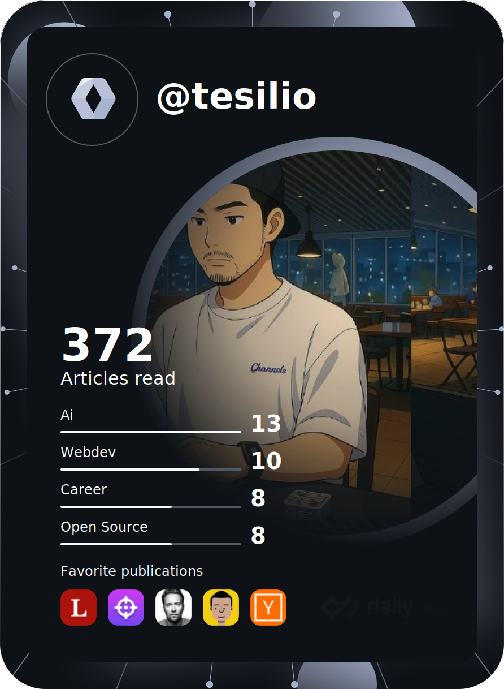

  

## About Me

백엔드 개발자 김세현 입니다. 안정적이고 확장 가능한 시스템 설계에 관심이 많습니다.

- Blog: [blog.tesilio.com](https://blog.tesilio.com)
- Email: lodcoco@gmail.com

## Tech Stack

  

## GitHub Stats

  
  

  

## Recent Blog Posts

<!-- BLOG-POST-LIST:START -->
<!-- BLOG-POST-LIST:END -->

## Dev Card

  

---

  
  

  

